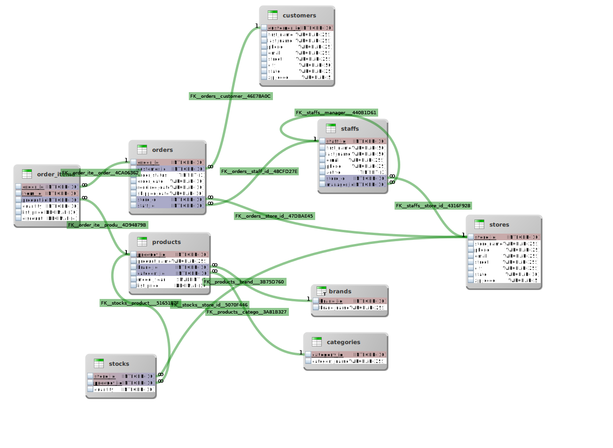
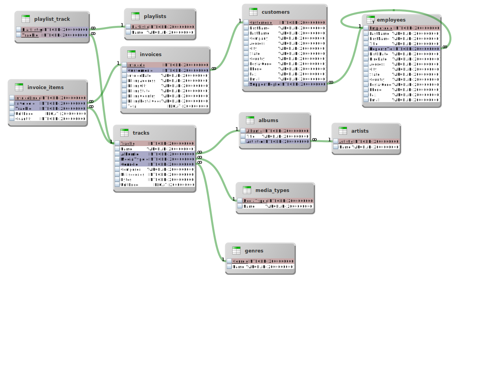
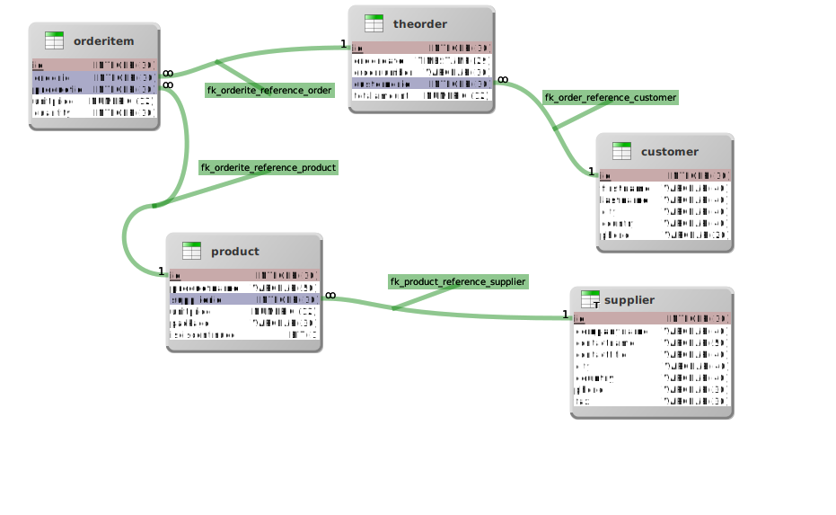
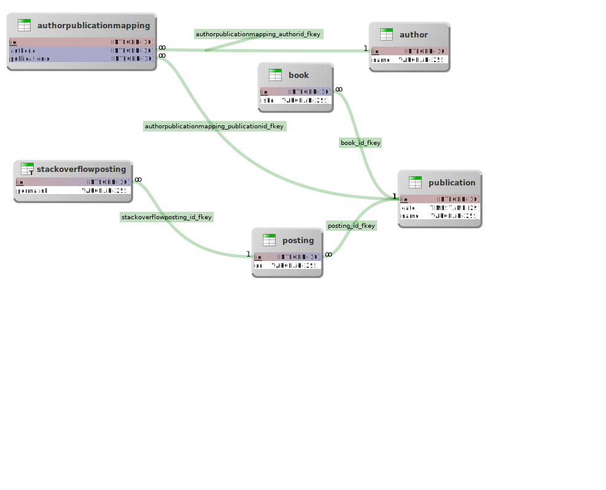

# jpa-sQLshell-tests

<!---

--->

I got the idea from a different repo https://github.com/josueribeiro/sqlite-jpa but it was horribly outdated (hibernate 3.5)
and did just not work so i set up my own. 

Why did i set up that project? Well, I wanted to test several tools that claimed to be able to build (JPA) Entity classes
from an existimg datamodel (meaning from actual tables in a database). But it turned out - none of them could (out
of the box) and I was not patient enough to comb through arcane configuration files.

Remembering that i had the [sQLshell](https://elbosso.github.io/sQLshell) having numerous plugins already to document existing models starting from a table and then following 
all foreign key relationships, I thought it schould be possible to actually generate java source code instead of
HTML.

The most important things for me were:

* gather all tables connected by foreign key relationships and generate Entities for them
* generate the relationships (One2Many and Many2One) according to the foreign keys
* extract index information if available but leave it commented out
* detect Many2Many mappings and generate annotations for them so that they are usable later on

This project already contains some tests for some of the models I tested the plugin with. Over time, more and more tests 
will be added here.

So i sat down and tried my hand at it - with the results everyone can see in this project. 
The generated Entities are below package
`de.elbosso.generated.sqlshell` - bikestores contains the result I got from a MS SQL example database:

 
chinook 
contains the results i got from the example database for sqlite. 

package entities holds the results from an example 
in a HSQL database.

package inheritance contains a datamodel meant for testing inheritance strategies in JPA

